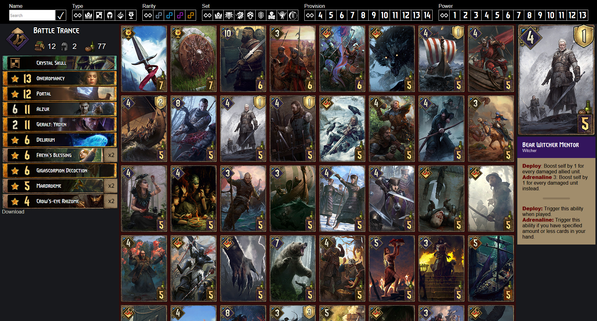

# Gwent Deck Builder
Requires [GwentOneDB](https://github.com/teddybee-r/GwentOneDB "github.com/teddybee-r/GwentOneDB")  

# Work in Progress
Just wait we're slowly getting there..  
Most of the stuff here right now is get things on the screen not get them nicely there.  

# Decklist images
Using [html2canvas](https://html2canvas.hertzen.com/ "html2canvas.hertzen.com") (.js) for deck images.

# Deck codes
The main idea is to give cards short ids and then just dump these short ids to the url.  
This is done by shortening the artid length(4) with Base64 to generate a unique url friendly code length(2). 
I am shifting it by 900 down. Art ids start at 1000 with the highest being 2439. With this method we have 
around 4000 codes before we run out and need to switch to length(3) and use the id. 
The order in the URL does not matter. We read the code and rebuild the decklist, sort and print it.
```js
    // artid: 1278, shift:  900
    Base64.fromNumber(1278-900);
    // result: "5w"
    
    // id:   15240
    Base64.fromNumber(15240);
    // result: "3k8"
```

# preview


# todos
- rewrite for multi lang
- rewrite html/css/js .DeckCard (deckbuilder.js)
- rewrite so no db required (fetch data via gwent.one, write decklist api)
- validation (ready but not implemented)
- restructuring

# bugs
- ?

# tweaks
- I should really inline more of my css assets and dump things like assets.scss (one of the reasons I switched back to images for values is actually html2image. using the gwent font with html2canvas doesnt produce the same quality as images)

# notice
I am no developer all of my knowledge is build up with gwent.one.  
This includes the backend since everything is hosted on baremetal in docker containers.  
I'll gladly take advices but please note that I want to understand things.  
I want to go without libaries and scripts (html2canvas) as much as possible.  
gwent.one is also being slowly redone without bootstrap.  

This is why you'll might find some stuff in here that does nothing :)